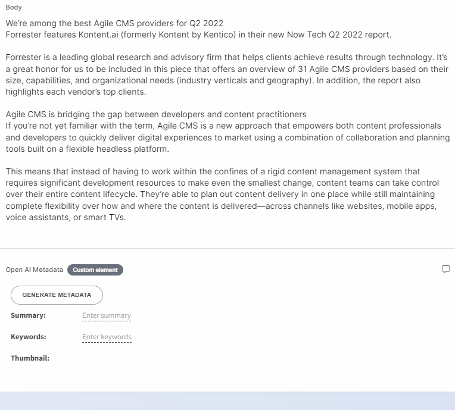

# OpenAI Metadata custom element

This is a [custom element](https://docs.kontent.ai/tutorials/develop-apps/integrate/integrating-your-own-content-editing-features) for [Kontent.ai](https://kontent.ai) that generates metadata for your texts using OpenAI.



## Setup

1. Deploy the code to a secure public host
   - See [deploying section](#Deploying) for a really quick option
1. Follow the instructions in the [Kontent.ai documentation](https://docs.kontent.ai/tutorials/develop-apps/integrate/integrating-your-own-content-editing-features#a-3--displaying-a-custom-element-in-kentico-kontent) to add the element to a content model.
   - The `Hosted code URL` is where you deployed to in step 1
   - Pass the necessary parameters as directed in the [JSON Parameters configuration](#json-parameters) section of this readme.

## Deploying

Netlify has made this easy. If you click the deploy button below, it will guide you through the process of deploying it to Netlify and leave you with a copy of the repository in your GitHub account as well.

[](https://app.netlify.com/start/deploy?repository=https://github.com/hzik/OpenAIMetadata)

## JSON Parameters

You need to specify the `service` and `source` parameter in order to make the element work.

```Json
{
    "service": "https://",
    "source": "body"
}
```

## Saved Value

The value is saved as a string representing a JSON object. When deserialized, it will look like:

```json
{
  "summary": "lorem ipsum",
  "keywords": "lorem ipsum",
  "thumbnail": "https://"
}
```

